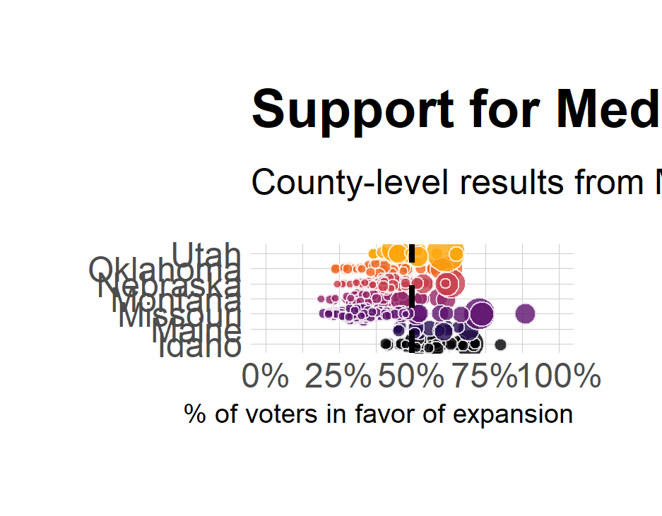

# medicaid-ballot

## TODO (5/20/2021):

- filter to correct ballot
- choose columns to keep
- pivot to have results on same row
- final product: date of ballot, state of ballot, county, votes in favor, votes against, total votes, share in favor, share against

## TODO (5/28/2021):

- make code conform to tidy style guide (https://style.tidyverse.org/index.html)
- finish cleaning up the excel files and combine resulting tidy data into one tibble

## TODO (6/2/2021):

- [x] finish cleaning up Missouri and merge into bigger dataset
- [x] create folder for output data and output data there as .rds
- [ ] design + implement quality checks
- [x] figure out how to use tidycensus R package to access county-level census data
- [x] merge aca_refs with tidycensus data in merge_census.R

## TODO (7/15/2021):

- [ ] decide what you want the final product to look like
- [ ] add label to state plots so it's clear what the national average is
- [ ] look for religion data in tidycensus to merge in
- [ ] other relevant variables that would explain support? 
- [ ] adapt predictive modeling template to your data